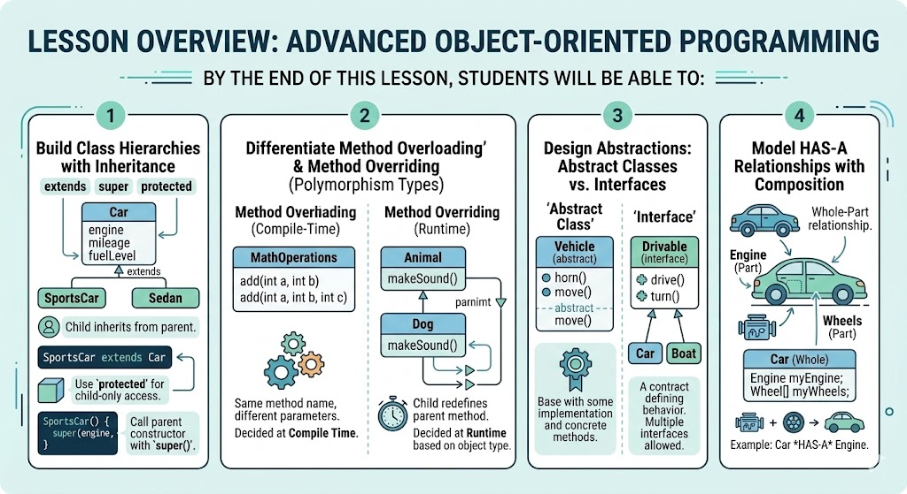

# [3.7] Advanced Object-Oriented Programming

## Lesson Overview

## Dependencies
- [Self Studies](./studies.md)
- [Lesson](./lesson.md)
- [Assignment](./assignment.md)
- [Slide Deck](./slides.md)

## Lesson Objectives
* **Apply** inheritance using `extends`, `super`, and `protected` to build class hierarchies
* **Differentiate** method overloading (compile-time) and overriding (runtime polymorphism)
* **Design** abstractions using abstract classes and interfaces
* **Model** HAS-A relationships using composition

## Lesson Plan

| Duration | What | How or Why |
|----------|------|------------|
| 10 min | Warm up | Recap Lesson 3.6 — review encapsulation, classes, and OOP pillars |
| 15 min | Part 1: Encapsulation recap | Revisit Person class; validate fields with setBirthYear example |
| 25 min | Part 2: Inheritance | extends, super constructors, protected; build Student from Person |
| 10 min | Activity 1 — Teacher class | Students create Teacher extending Person |
| 20 min | Part 3: Polymorphism | Method overloading (Calculator) and overriding (doWork); @Override annotation |
| 5 min | Activity 2 — Teacher overrides | Students override doWork and greet in Teacher |
| 10 min | Break | — |
| 25 min | Part 4: Abstraction | Abstract classes, interfaces, default methods; LearnInterfaces code-along |
| 20 min | Activity 3 — Vehicle hierarchy | Students build Vehicle, Car, ElectricCar with interfaces |
| 15 min | Part 5: Composition | HAS-A vs IS-A; Radio + Car/ElectricCar example |
| 15 min | Wrap up | Recap 4 OOP pillars, composition, preview assignment, Q&A |
| **Total** | | **170 min — allows ~10 min buffer** |